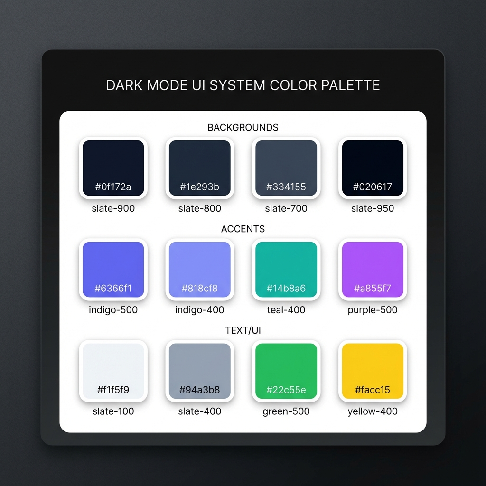

# STC Design System & Style Guide
## Dr. Sabri Abu Quron Training Center

> **Version**: 1.0  
> **Last Updated**: December 22, 2025

### Visual Color Palette



---

## 🎨 Color Palette

### Primary Colors

| Name | Hex | RGB | Usage |
|------|-----|-----|-------|
| **Primary Background** | `#0f172a` | `rgb(15, 23, 42)` | Main page background |
| **Secondary Background** | `#1e293b` | `rgb(30, 41, 59)` | Cards, inputs, elevated surfaces |
| **Tertiary Background** | `#334155` | `rgb(51, 65, 85)` | Borders, dividers, scrollbar |
| **Darkest** | `#020617` | `rgb(2, 6, 23)` | Footer background |

### Accent Colors

| Name | Hex | RGB | Usage |
|------|-----|-----|-------|
| **Indigo Primary** | `#6366f1` | `rgb(99, 102, 241)` | Primary CTA, focus states, glows |
| **Indigo Light** | `#818cf8` | `rgb(129, 140, 248)` | Hover states, gradient end |
| **Teal Accent** | `#14b8a6` | `rgb(20, 184, 166)` | Secondary accent, gradient end |
| **Purple Accent** | `#a855f7` | `rgb(168, 85, 247)` | Background orbs, decorative |

### Text Colors

| Name | Hex | RGB | Usage |
|------|-----|-----|-------|
| **Primary Text** | `#f1f5f9` | `rgb(241, 245, 249)` | Headlines, body text |
| **Secondary Text** | `#94a3b8` | `rgb(148, 163, 184)` | Subtitles, descriptions |
| **Muted Text** | `#64748b` | `rgb(100, 116, 139)` | Hints, timestamps |
| **Indigo Text** | `#a5b4fc` | `rgb(165, 180, 252)` | Links, highlights |

### Semantic Colors

| Name | Hex | Usage |
|------|-----|-------|
| **Success/WhatsApp** | `#22c55e` | Success states, WhatsApp button |
| **Warning/Stars** | `#facc15` | Star ratings, warnings |
| **Error** | `#f87171` | Error messages, validation |

---

## 📝 Typography

### Font Families

```css
/* English */
font-family: var(--font-inter, ui-sans-serif, system-ui, -apple-system, sans-serif);

/* Arabic */
font-family: var(--font-tajawal, 'Tajawal', 'Segoe UI', Tahoma, sans-serif);
```

### Font Scale

| Class | Size | Weight | Usage |
|-------|------|--------|-------|
| `text-6xl` | 3.75rem (60px) | 700 (Bold) | Hero headlines (desktop) |
| `text-5xl` | 3rem (48px) | 700 (Bold) | Hero headlines (mobile) |
| `text-4xl` | 2.25rem (36px) | 700 (Bold) | Section titles |
| `text-3xl` | 1.875rem (30px) | 700 (Bold) | Card titles |
| `text-xl` | 1.25rem (20px) | 500 (Medium) | Subtitles |
| `text-lg` | 1.125rem (18px) | 400 (Regular) | Lead paragraphs |
| `text-sm` | 0.875rem (14px) | 400 (Regular) | Body text, labels |
| `text-xs` | 0.75rem (12px) | 400 (Regular) | Captions, hints |

---

## 🧩 Component Styles

### Glass Card

```css
.glass-card {
  backdrop-filter: blur(12px);
  background: rgba(255, 255, 255, 0.05);
  border: 1px solid rgba(255, 255, 255, 0.1);
  box-shadow: 0 25px 50px -12px rgba(0, 0, 0, 0.25);
  border-radius: 1.5rem; /* rounded-3xl */
}
```

### Primary Button (CTA)

```css
.btn-primary {
  padding: 1rem 2.5rem;
  border-radius: 9999px; /* rounded-full */
  background: linear-gradient(to right, #6366f1, #a855f7);
  color: white;
  font-weight: 700;
  box-shadow: 0 0 30px rgba(99, 102, 241, 0.6);
  transition: all 0.3s ease;
}

.btn-primary:hover {
  background: linear-gradient(to right, #818cf8, #c084fc);
  box-shadow: 0 0 45px rgba(99, 102, 241, 0.8);
  transform: scale(1.05);
}
```

### Secondary Button

```css
.btn-secondary {
  padding: 1rem 2.5rem;
  border-radius: 9999px;
  background: rgba(255, 255, 255, 0.1);
  backdrop-filter: blur(12px);
  border: 2px solid rgba(255, 255, 255, 0.4);
  color: white;
  font-weight: 700;
  transition: all 0.3s ease;
}

.btn-secondary:hover {
  border-color: white;
  background: rgba(255, 255, 255, 0.2);
  box-shadow: 0 0 25px rgba(255, 255, 255, 0.3);
  transform: scale(1.05);
}
```

### Form Input

```css
.input {
  width: 100%;
  padding: 0.75rem 1rem;
  background: #1e293b;
  border: 1px solid #334155;
  border-radius: 0.5rem;
  color: white;
  transition: all 0.2s ease;
}

.input:focus {
  outline: none;
  border-color: transparent;
  box-shadow: 0 0 0 2px #6366f1;
}
```

---

## 🎭 Effects & Shadows

### Glow Effects

```css
/* Primary Glow */
--shadow-glow: 0 0 20px rgba(99, 102, 241, 0.4);
--shadow-glow-hover: 0 0 30px rgba(99, 102, 241, 0.6);

/* Avatar Glow */
box-shadow: 0 0 40px rgba(99, 102, 241, 0.5);

/* WhatsApp Glow */
box-shadow: 0 4px 20px rgba(34, 197, 94, 0.5);
```

### Gradient Text

```css
.gradient-text {
  background: linear-gradient(to right, #818cf8, #14b8a6);
  -webkit-background-clip: text;
  -webkit-text-fill-color: transparent;
  background-clip: text;
}
```

---

## 🎬 Animation System

### Keyframes

```css
/* Fade In Up */
@keyframes fadeIn {
  from {
    opacity: 0;
    transform: translateY(10px);
  }
  to {
    opacity: 1;
    transform: translateY(0);
  }
}

/* Gradient Flow (Background) */
@keyframes gradientFlow {
  0% { background-position: 0% 50%; }
  50% { background-position: 100% 50%; }
  100% { background-position: 0% 50%; }
}

/* Subtle Pulse (Orbs) */
@keyframes subtlePulse {
  0%, 100% {
    opacity: 0.15;
    transform: scale(1);
  }
  50% {
    opacity: 0.2;
    transform: scale(1.05);
  }
}
```

### Framer Motion Variants

```typescript
// Fade In Up
const fadeInUp = {
  hidden: { opacity: 0, y: 30 },
  visible: {
    opacity: 1,
    y: 0,
    transition: { duration: 0.6, ease: "easeOut" },
  },
};

// Staggered Container
const containerVariants = {
  hidden: { opacity: 0 },
  visible: {
    opacity: 1,
    transition: {
      staggerChildren: 0.1,
      delayChildren: 0.1,
    },
  },
};

// Premium Bounce Curve
const premiumBounce = [0.22, 1, 0.36, 1];
```

---

## 📐 Layout System

### Container

```css
.container {
  max-width: 72rem; /* 1152px - max-w-6xl */
  margin: 0 auto;
  padding: 0 1.5rem; /* px-6 */
}
```

### Spacing Scale

| Class | Value | Usage |
|-------|-------|-------|
| `py-4` | 1rem | Navbar (scrolled) |
| `py-8` | 2rem | Navbar (top) |
| `py-20` | 5rem | Section padding |
| `py-24` | 6rem | Large section padding |
| `gap-6` | 1.5rem | Grid gaps |
| `gap-8` | 2rem | Large grid gaps |
| `mb-12` | 3rem | Section header margin |

### Grid Layouts

```css
/* 3-Column (Desktop) */
grid-template-columns: repeat(3, 1fr);

/* 2-Column (Tablet) */
@media (min-width: 768px) {
  grid-template-columns: repeat(2, 1fr);
}

/* 4-Column Values Grid */
@media (min-width: 1024px) {
  grid-template-columns: repeat(4, 1fr);
}
```

---

## 🌐 RTL Support

### Direction Classes

```css
[dir="rtl"] {
  text-align: right;
}

/* Input padding adjustment */
.input-rtl {
  padding-left: 2.5rem;
  padding-right: 1rem;
  text-align: right;
}

.input-ltr {
  padding-right: 2.5rem;
  padding-left: 1rem;
  text-align: left;
}
```

---

## ♿ Accessibility

### Focus States

```css
:focus-visible {
  outline: 2px solid rgb(99, 102, 241);
  outline-offset: 2px;
}
```

### Reduced Motion

```css
@media (prefers-reduced-motion: reduce) {
  *, *::before, *::after {
    animation-duration: 0.01ms !important;
    animation-iteration-count: 1 !important;
    transition-duration: 0.01ms !important;
  }
}
```

---

## 📁 File Structure

```
src/
├── app/
│   ├── globals.css          # Global styles & CSS variables
│   └── [locale]/
│       └── layout.tsx       # Font loading, theme setup
├── components/
│   ├── layout/
│   │   ├── Navbar.tsx       # Fixed navigation
│   │   └── Footer.tsx       # Site footer
│   ├── ui/
│   │   ├── GradientDivider.tsx
│   │   ├── NetworkBackground.tsx
│   │   ├── WhatsAppButton.tsx
│   │   └── LanguageSwitcher.tsx
│   └── home/
│       ├── Hero.tsx
│       ├── Philosophy.tsx
│       └── Testimonials.tsx
```

---

*This style guide is auto-generated from the codebase analysis.*
